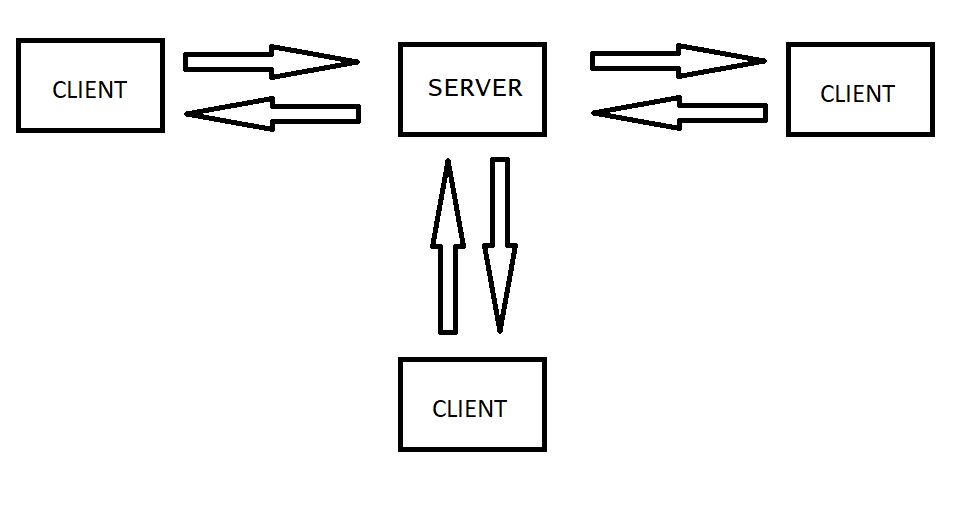
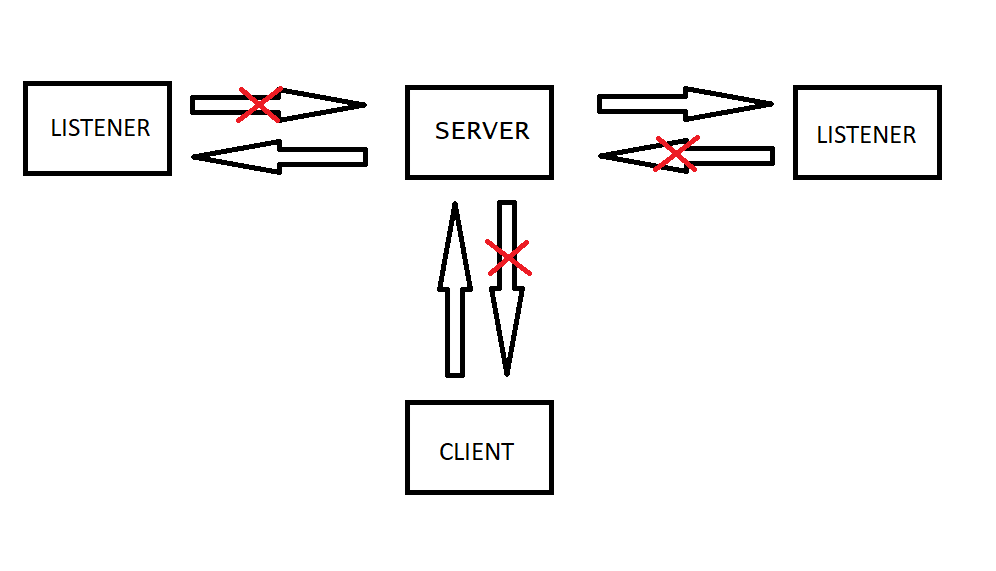

## TCP-Server
A simple local TCP-server, created using C++ and [Winsock](https://en.wikipedia.org/wiki/Winsock). 

Recommended video to watch: [youtube](https://www.youtube.com/watch?v=WDn-htpBlnU).

A lot of the code used in the video has been used to create this project.

## The idea.

The idea is to have clients that send and receive messages via the server. 

## What it looks like.

